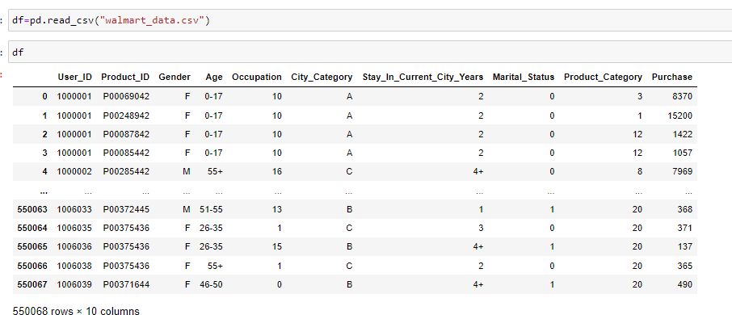
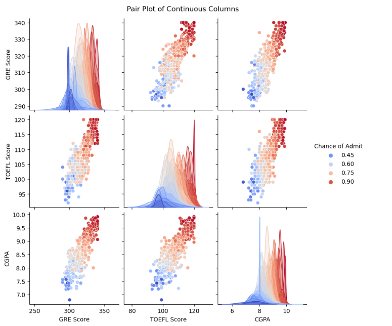
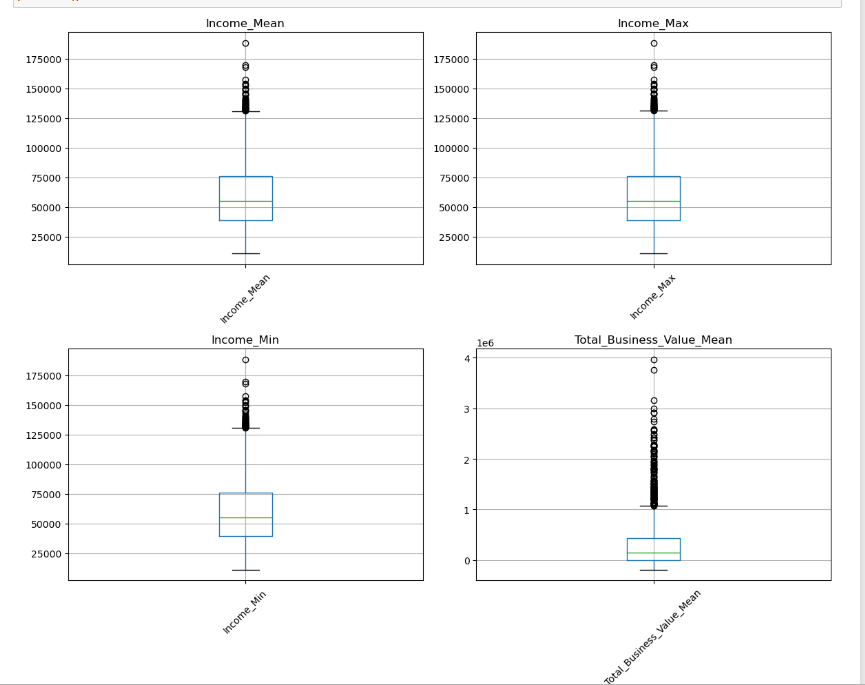
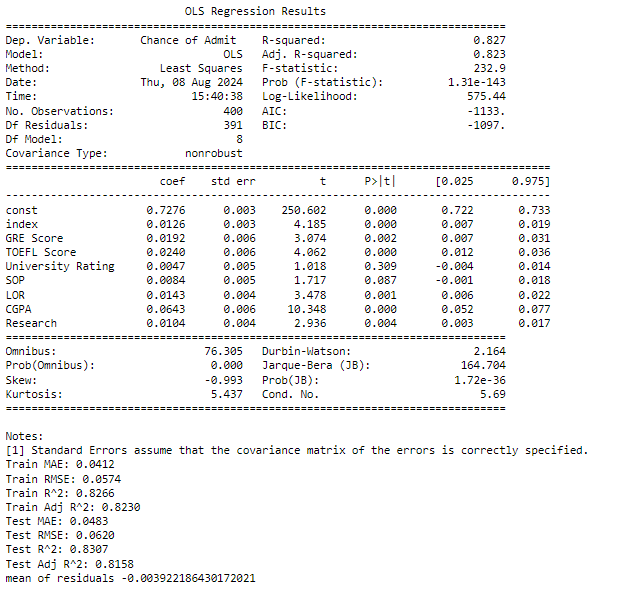
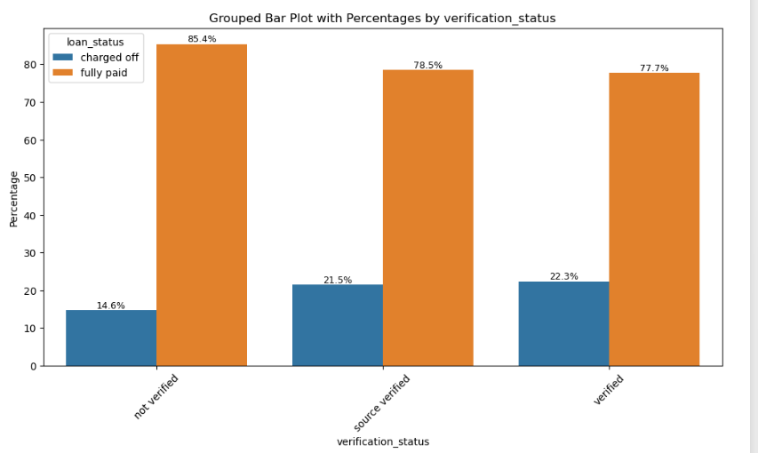
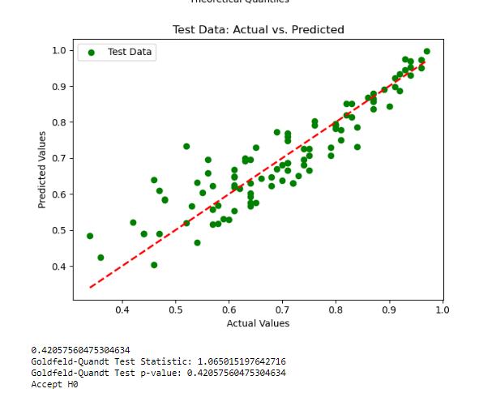
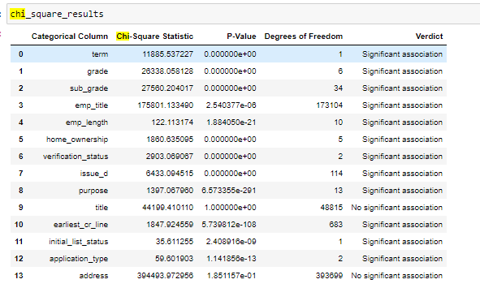
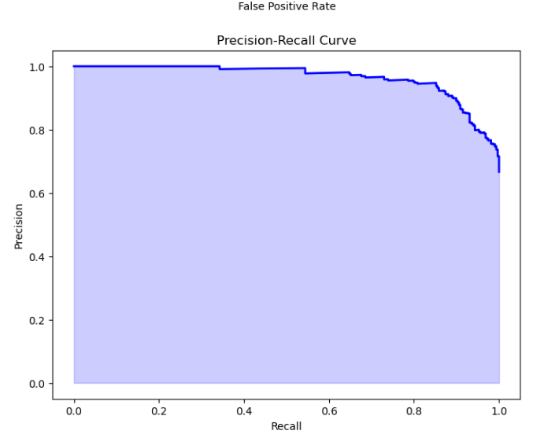
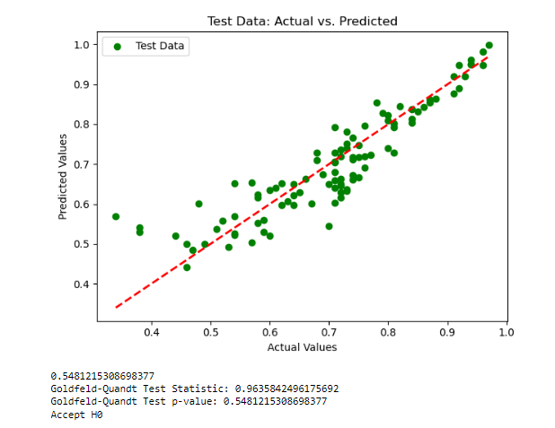
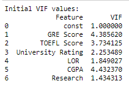

# Ola Case-Study

## Description
This case study focuses on predicting driver attrition for Ola, a leading ride-hailing company. High churn rates among drivers present significant challenges, including increased recruitment costs and operational inefficiencies. By analyzing driver demographics, tenure, and performance data, we aim to develop models that can accurately predict driver attrition and provide actionable insights to improve retention.

## Business Problem
Recruiting and retaining drivers is a major challenge for Ola due to high churn rates. Drivers can easily switch to competitors like Uber, leading to increased acquisition costs and impacting organizational morale. The goal is to predict whether a driver will leave the company based on various attributes and develop strategies to reduce attrition.

## Data Information

The dataset contains monthly information for a segment of drivers for the years 2019 and 2020. The attributes include:

- Demographics: city, age, gender, etc.
- Tenure information: joining date, last date
- Historical performance data: quarterly rating, monthly business acquired, grade, income

## Business Insights
### Driver Age Distribution
- **Insight:** Drivers aged between 20 and 25 contribute to over 20% of the total driver base.
- **Implication:** This age group is significant in the driver pool and may require targeted retention strategies.

### Gender Distribution
- **Insight:** The driver base consists of 58% male and 42% female drivers.
- **Implication:** Gender distribution is reasonably balanced but could influence targeted marketing and support programs.

### City Distribution
- **Insight:** Data is uniformly spread across 29 unique cities.
- **Implication:** This suggests a broad geographical coverage but may require city-specific strategies to address local variations.

### Correlation with Has_Left

- **Insight:** Strong correlations exist between Has_Left and several features including Income_mean, Income_max, Grade_mean, Total_business_value_mean, Quarterly_rating, Income_increased, and Quarterly_rating_increased.
- **Implication:** These factors are significant predictors of driver attrition.

### Outliers

- **Insight:** Numerical columns contain significant outliers.
- **Implication:** Outliers could impact model performance but were addressed post-initial model building, showing no significant impact.

### High Attrition by Grade
- **Insight:** 80% of drivers in Grade 1 have left.
- **Implication:** Grade 1 drivers are at a higher risk of attrition.

### Quarterly Rating Increase
- **Insight:** 75% of drivers whose Quarterly Rating Increased have left.
- **Implication:** This suggests that despite improvement in ratings, these drivers are leaving, indicating potential underlying dissatisfaction.

### Income Impact
- **Insight:** 68% of drivers whose income did not increase have left.
- **Implication:** Income growth is a significant factor in driver retention.

### Tenure and Attrition
- **Insight:** 88% of drivers who have spent 5 years at the company have left, with a notable spike in attrition around the 5-year mark.
- **Implication:** Driver tenure significantly impacts attrition.

## EDA
### Variable Distributions and Relationships
- Analyzed the distribution of demographic variables such as age, gender, and city.
- Explored the relationships between tenure information, performance metrics, and attrition rates.
- Identified significant predictors of attrition through correlation analysis.

## Model Building Approaches
- **Ensemble Learning: Bagging and Boosting**
  - Implemented various ensemble learning techniques to improve model performance.
- **KNN Imputation**
  - Used KNN imputation to handle missing values.
- **Imbalanced Dataset Handling**
  - Applied techniques like SMOTE to address class imbalance but observed limited improvement.
- **Feature Scaling and Selection**
  - Tree-based models were used, making feature scaling irrelevant. Feature selection using VIF and outlier removal were not helpful.

## Model Insights
### Overall Performance
- **Best Overall Precision:** TunedRF (0.9331)
- **Best Overall Recall:** Simple GB (0.9025)
- **Best Overall F1 Score:** TunedGB (0.9013)
- **Best ROC AUC:** TunedGB (0.9286)

### Class-wise Performance
- **Class 0 Precision:** Simple GB (0.8000), Simple LGBM (0.7778)
- **Class 0 Recall:** TunedRF (0.8805), TunedXGB (0.7799)
- **Class 1 Precision:** TunedRF (0.9331)

- **Class 1 Recall:** Simple GB (0.9025), Simple XGB (0.8868)

### Trade-offs
- **TunedGB** offers the best balance between precision, recall, and F1 score, with high ROC AUC.

- **TunedRF** has the highest precision for Class 1 but slightly lower recall.
- Simple models generally provide less optimal performance compared to their tuned counterparts, highlighting the effectiveness of hyperparameter tuning.

### Model Selection Guidance
- **For Balanced Precision and Recall:** TunedGB is a strong choice.
- **For High Precision in Class 1:** TunedRF is preferable, especially if the cost of false positives is high.
- **For Class 0 Performance:** Simple GB and Simple LGBM might be more suitable if Class 0 is critical and recall is important.

### FP and FN Insights
- **TunedRF** has the highest false negatives, suggesting it misses many actual positives but is effective where false positives are more acceptable.
- **TunedGB** offers balanced performance with moderate FP and FN, making it good for general-purpose use.
- **TunedLGBM** has similar characteristics to TunedGB, making it versatile for varied applications.
- Simple models generally have moderate performance metrics.

## Recommendations
### Targeted Retention Strategies for Young Drivers
- **Recommendation:** Develop retention programs specifically designed for drivers aged 20-25, including career development opportunities, performance incentives, and enhanced support systems.

### Gender-Specific Support Programs
- **Recommendation:** Implement support and engagement programs tailored to both male and female drivers, considering their different needs and preferences.

### City-Specific Strategies
- **Recommendation:** Analyze driver attrition patterns in different cities and develop localized strategies to improve driver satisfaction and retention.

### Focus on Key Predictors of Attrition
- **Recommendation:** Use features such as Income_mean, Income_max, Grade_mean, Total_business_value_mean, Quarterly_rating, Income_increased, and Quarterly_rating_increased to build predictive models. Implement targeted interventions based on these predictors to reduce attrition.

### Address Driver Attrition in Grade 1
- **Recommendation:** Investigate the reasons for high attrition among Grade 1 drivers and develop tailored retention initiatives, such as career advancement programs or increased support.

### Investigate Quarterly Rating Increase
- **Recommendation:** Analyze why drivers with increased Quarterly Ratings are leaving. Consider implementing feedback mechanisms or adjusting performance evaluation criteria to address potential issues.

### Enhance Income Growth Opportunities
- **Recommendation:** Ensure that income growth opportunities are available and clearly communicated to drivers. Consider introducing regular reviews and incentives to improve income satisfaction.

### Develop Programs for Long-Tenure Drivers
- **Recommendation:** Create retention strategies focused on drivers approaching the 5-year tenure mark. Offer incentives, career development programs, or role enhancements to retain these drivers.

### Review and Manage Outliers
- **Recommendation:** Review the impact of outliers in numerical columns post-initial model building and adjust models or strategies accordingly to mitigate any negative effects.

---

By addressing these insights and implementing the recommendations, Ola can improve driver retention, reduce costs, and enhance overall operational efficiency.