# Case Studies and Projects by Akash Namdeo

Welcome to my collection of data science case studies and projects. This repository showcases a diverse set of problems I have solved across different industries. From market analysis and predictive modeling to hypothesis testing and business insights, these projects demonstrate my ability to analyze, interpret, and provide actionable insights from data.

## Business Problem

The key business problem is the **forecasting of future view counts** for a large number of Wikipedia pages. AdEase needs to:

### 1. Optimize Ad Placement

Predict which Wikipedia pages will have the highest number of views, enabling AdEase to place ads on high-traffic pages for maximum visibility and engagement.

### 2. Minimize Ad Costs

By understanding which pages will receive more views, AdEase can avoid placing ads on low-traffic pages, helping to minimize costs for clients.

### 3. Regional and Language-Specific Forecasting

Since AdEase's clients belong to different regions, understanding how page views vary by region and language will help tailor ad campaigns that are region-specific. This segmentation ensures that ads are placed in culturally relevant contexts, improving performance and customer satisfaction.

### 4. Scalability

The solution should be able to scale efficiently for 145,000 pages, providing forecasts without compromising speed or quality of predictions.

## Key Objectives

- **Forecasting Future Views**: Use historical view count data to predict the future views for each Wikipedia page.
- **Time Series Analysis**: Implement time series forecasting techniques due to the temporal nature of the data.
- **Regional and Language Prediction**: Account for the impact of different regions and languages on view counts.
- **Ad Optimization**: Provide actionable insights to optimize ad placements based on predicted views.

By addressing these business needs, AdEase aims to improve its clients' advertising strategies by ensuring more effective ad placements and maximizing return on investment.

## Explotarotory Data Analysis

## How data looks like ?
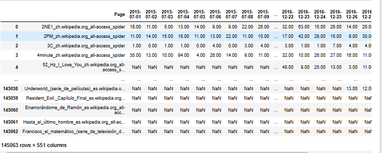
145063 rows and  551 columns

## splitted the Data into Title, Language, Access Type, Access Origin

## Lets see distribution of Language,Access type and Origin
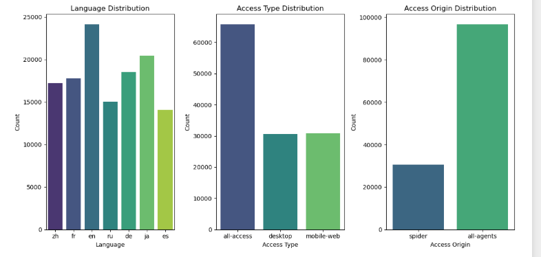
    - **Language**: The most common language appears to be 'en', followed by 'ja' and 'de'.
    - **Access Type**: The majority of visitors seem to access the website via 'all-access', followed by 'desktop'.
    - **Access Origin**: The 'all-agents' origin has a significantly higher count compared to 'spider'.

    - English (en) is the most frequently used language, accounting for 16.62% of visits, followed by Japanese (ja) at 14.08%.
    - "All-access" is the dominant access type, comprising 45.30% of visits, while "all-agents" is the primary access origin at 66.59%.

## Data we have after melting dates from column to rows
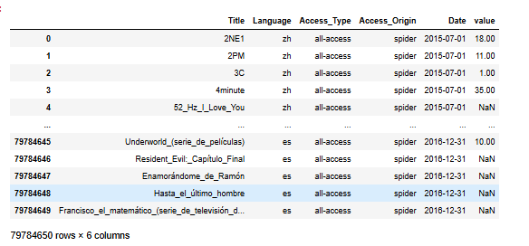

### Monthly Language Page Visits
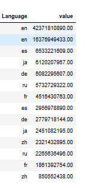

### Top 10 Most Visited Titles for Each Language
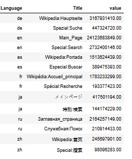

### Total Visits Per Language
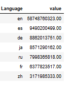

### Monthly Visits for Each Title
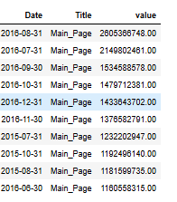

### Top 5 Languages by Total Visits
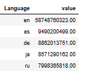

### Trend Analysis of Visits Over Time
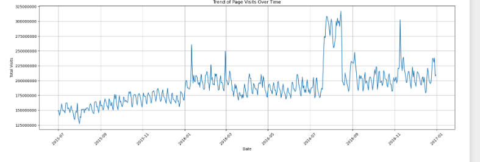
    - There's sudden spike in 08-2016 

### Range of data
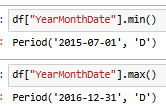

### monthly page view over time for english laguage
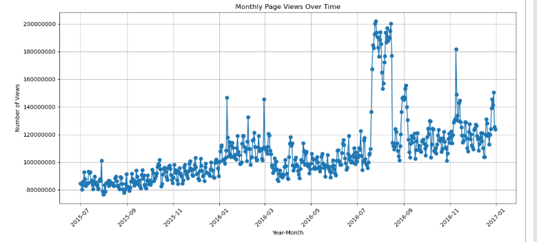
    - There is sudden spike in data

## What we interpret from MA?
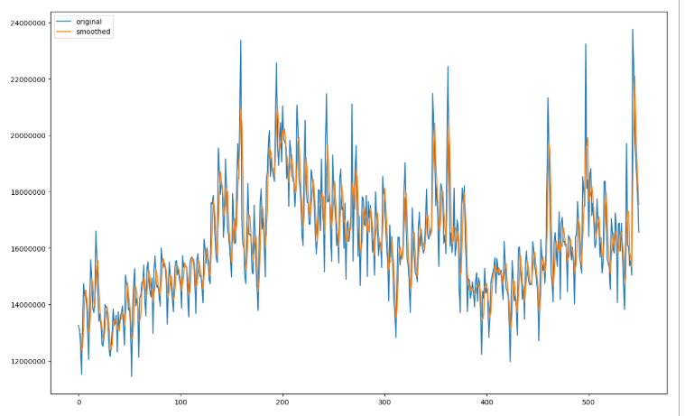
**Possible Interpretations**:

    Seasonality: The cyclical pattern suggests that the data might be influenced by seasonal factors.there could be seasonal peaks during certain times of the year.
    Moving Average Effect: The smoothed line helps to identify the overall trend and remove short-term noise. This can be useful for forecasting and making informed decisions.
    Anomalies: The original series shows some sharp spikes that are not captured by the smoothed line. These could be potential anomalies or outliers that warrant further investigation.
    Further Analysis:

    Decomposition: Decomposing the time series into its trend, seasonality, and residual components can provide a more detailed understanding of its behavior.
    Anomaly Detection: Techniques like Isolation Forest or other anomaly detection methods can be used to identify and investigate the potential anomalies.
    Forecasting: Time series forecasting models can be used to predict future values of the series based on the observed patterns.

## Is there upward trend in data?
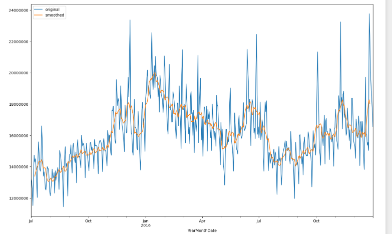

    It seems that the smoothed line does not exhibit a consistent upward trend. There are periods of increase followed by periods of decrease, suggesting a more complex pattern than a simple upward trend.

    Therefore, it is incorrect to say that there is a clear upward trend in the data.

    Possible Explanations:

    Seasonality: The fluctuations might be primarily driven by seasonal factors, with no clear overall upward or downward direction.

    Cyclical Pattern: There could be a cyclical pattern in the data, with recurring periods of growth and decline.
    Combination of Factors: The data might be influenced by a combination of factors, including seasonality, cyclical patterns, and potentially some underlying trend that is not easily discernible.
    Further Analysis:

    To better understand the underlying patterns,we will

    Decompose the time series: Break down the data into its trend, seasonality, and residual components. This will help to isolate the trend (if any) from other factors.

## Linear Regression to identify trend in data!!!
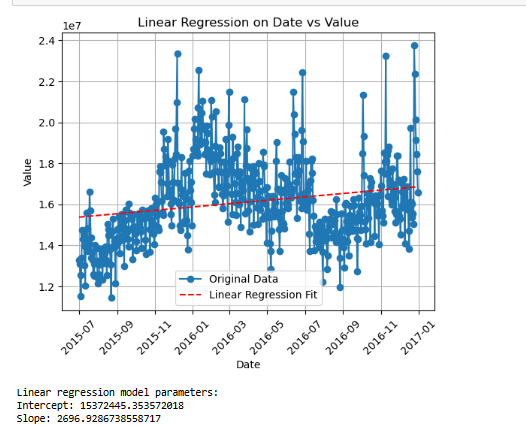

    The output of linear regression model indicates the following:

    Intercept: 15,372,445.35
    This represents the value when the independent variable (days_since_start) is 0. In other words, this is the value predicted for the first day in your dataset (the base value before the trend starts).

    Slope: 2,696.93
    The slope indicates the amount by which the dependent variable (the value) increases or decreases per unit change in the independent variable (days_since_start). In this case, the slope is positive, meaning the value is increasing by approximately 2,696.93 units per day.

    Interpretation:
    Positive Slope: Since the slope is positive, it suggests that the value increases as the time progresses. In other words, there is an upward trend in your data.
    Intercept: The intercept gives us an idea of the starting point of the trend when time is at 0 (i.e., the first date in your data).

## Seasonality

### is the seasonality multiplicative or additive?
Lets see this example:
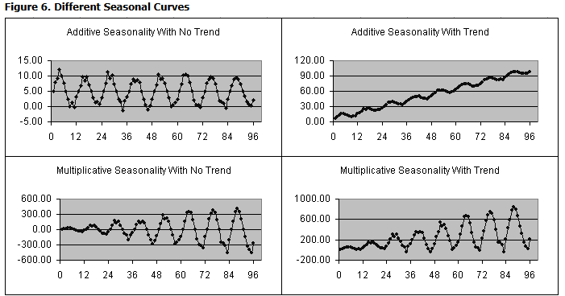

When we do decompose the series is broken down into Trend,seasonality and residual.
Suppose the series is Y = [100, 110, 120, 130, 125, 115, 105, 100, 95, 90, 85, 80]
The Trend will be moving average,lets take window size of 3 for it, so the trend will be T = [Nan,Nan,110, 120, 125, 123.33, 115, 106.67, 100, 95, 90, 85].
Now the seasonality will be   Y−T=[NaN, NaN, 10.0, 10.0, 0.0, -8.33, -10.0, -6.67, -5.0, -5.0, -5.0, -5.0]
and Residual [NaN, NaN, 10, 10, 0, -8.33, -10, -6.67, -5, -5, -5, -5].

Our decomosition looks like:
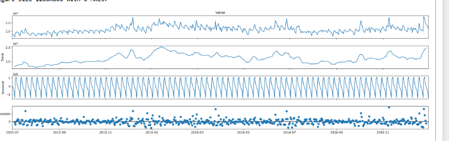
therefore seasonality is additive.

coefficinet of variance also suggests same.
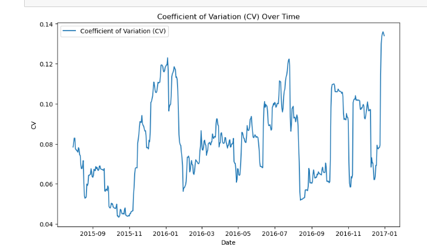

## Residuals

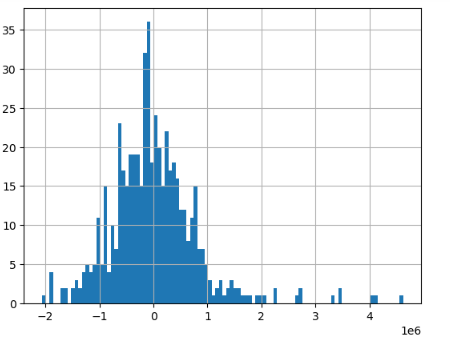

Observations:

Shape: The histogram appears to be roughly bell-shaped, suggesting that the residuals might be approximately normally distributed.

Symmetry: The distribution seems to be somewhat skewed to the right, indicating that there might be a few larger positive residuals compared to negative ones.

Central Tendency: The distribution is centered around zero, which is expected for residuals.

Interpretation:

Normality: The approximately bell-shaped distribution suggests that the residuals might be normally distributed. This is a desirable property for many time series models, as it supports the assumption of normally distributed errors.

Skewness: The slight right-skewness indicates that there might be a few larger positive outliers in the data. These outliers could be investigated further to understand their potential causes.

Central Tendency: The fact that the distribution is centered around zero indicates that the model is, on average, predicting the values of the time series accurately.

### Residual deviation
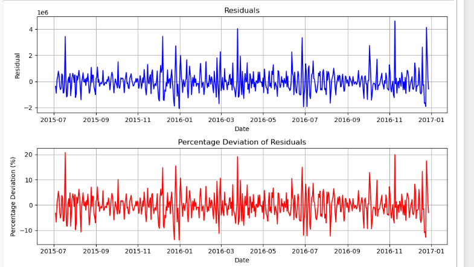
mean of residuals: 1521.35
max of series: 23760349.0
min of series: 11445863.0

Let's compare the mean residual to the range of values in the "value" column:

The range between the max and min values is: 23760349.0 - 11445863.0 = 12,314,486.0 
1521/12,314,486.0 = 0.01%

This means that the mean residual is about 0.0123% of the total range of the data.

## Generating Forecasts

### 1. Forecasting mean
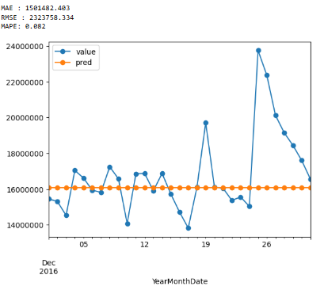

In this case, we can interpret it as, given that the model's values fluctuate between roughly 14m to 24m, and within those fluctuations, this model's error is around 1.5m approx.

The mean of data is approx 16m, and we're getting an MAE of 1.5m, this means roughly 9% predictions are wrong, with respect to the mean.

This is not good.
    MAE : 1501482.403
    RMSE : 2323758.334
    MAPE: 0.082

### 2. Naive Approach
Here last value from train set is taken as prediction for whole test data.
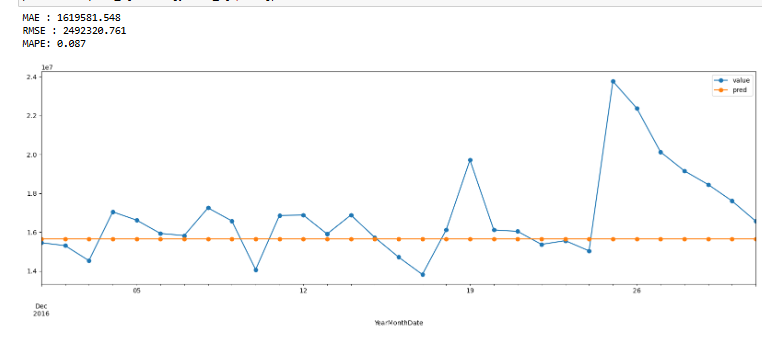
roughly 10% predictions are wrong, with respect to the mean.
    MAE : 1619581.548
    RMSE : 2492320.761
    MAPE: 0.087

### 3. Seasonal Naive
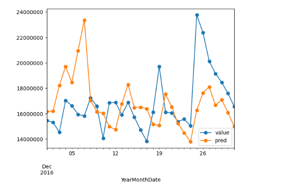

In this approach we go back say 1 year for every point in test data and populate the same value.
Here :
    MAE : 2177664.484
    RMSE : 2871461.05
    MAPE: 0.126

### Drift method
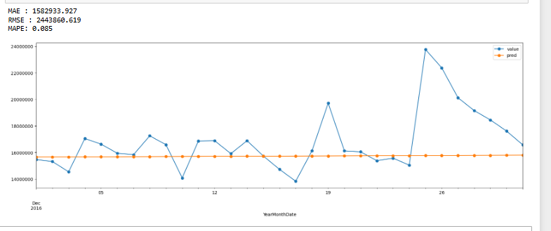

yt+h = yt + h*Slope
yt+1 = yt + 1*(yt-y0/t) 

