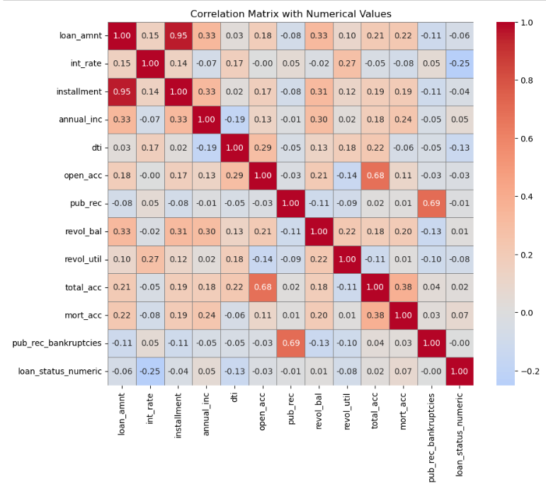
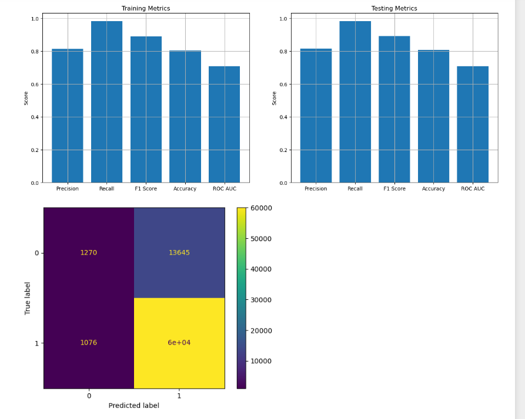
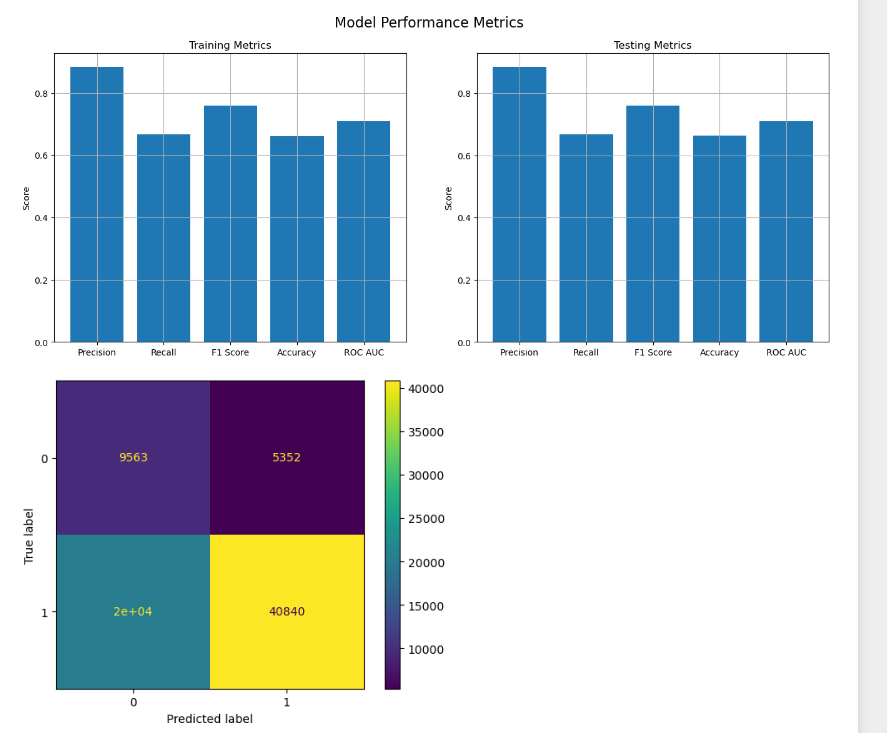
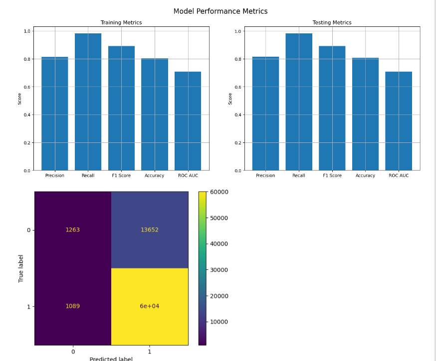
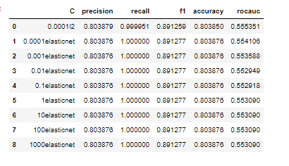

# LoanTap Case Study

## Problem Statement
LoanTap is an online platform committed to delivering customized loan products to millennials. The data science team at LoanTap is building an underwriting layer to determine the creditworthiness of MSMEs as well as individuals, specifically for Personal Loans.

Given a set of attributes for an Individual, determine if a credit line should be extended to them. If so, what should the repayment terms be?

## Data Information

The dataset consists of the following attributes:

- `loan_amnt`: The listed amount of the loan applied for by the borrower.
- `term`: The number of payments on the loan. Values are in months and can be either 36 or 60.
- `int_rate`: Interest Rate on the loan.
- `installment`: The monthly payment owed by the borrower if the loan originates.
- `grade`: LoanTap assigned loan grade.
- `sub_grade`: LoanTap assigned loan subgrade.
- `emp_title`: The job title supplied by the Borrower when applying for the loan.
- `emp_length`: Employment length in years.
- `home_ownership`: The home ownership status provided by the borrower.
- `annual_inc`: The self-reported annual income provided by the borrower.
- `verification_status`: Indicates if income was verified by LoanTap.
- `issue_d`: The month which the loan was funded.
- `loan_status`: Current status of the loan - Target Variable.
- `purpose`: A category provided by the borrower for the loan request.
- `title`: The loan title provided by the borrower.
- `dti`: Debt-to-income ratio.
- `earliest_cr_line`: The month the borrower's earliest reported credit line was opened.
- `open_acc`: The number of open credit lines in the borrower's credit file.
- `pub_rec`: Number of derogatory public records.
- `revol_bal`: Total credit revolving balance.
- `revol_util`: Revolving line utilization rate.
- `total_acc`: The total number of credit lines currently in the borrower's credit file.
- `initial_list_status`: The initial listing status of the loan.
- `application_type`: Indicates whether the loan is an individual or joint application.
- `mort_acc`: Number of mortgage accounts.
- `pub_rec_bankruptcies`: Number of public record bankruptcies.
- `address`: Address of the individual.

## Data Analysis
### Variable Distributions and Relationships
- **Loan Tenure Impact**:

  - 60 Months Tenure: 68% of individuals fully repaid their loan.
  - 36 Months Tenure: 84% of individuals fully repaid their loan.
- **Loan Repayment by Grade**:

  - Grade A: 93% of individuals fully repaid their loan.
- **Job Roles and Loan Repayment**:

  - Top Job Roles for Full Repayment: Teacher, Project Manager, Manager.
- **Irrelevant Factors**:

  - Employment Length and Verification Status: No significant effect on loan repayment.
- **Charged-Off Loans**:
  - Top Categories: Small Business and General Business.
- **Outlier Treatment**:
  - Continuous variables are treated for outliers using the Z-score strategy.
- **Significant Impact Analysis**:

  - Chi-square tests show a significant impact of categorical variables on the target variable.
- **Correlation Insights**:

  - High correlation between Installment and Interest Rate, and between Open Account and Total Account.

### Data Cleaning
- No duplicates found.
- Missing values (NaN) treated with Simple Imputer using the Median.

### Categorical Data Encoding
- Columns with fewer categories are converted to numerical values using One-Hot Encoding (OHE).
- Columns with more categories are encoded using Label Encoding.

## Model Building
### Logistic Regression Model Summary
#### Initial Model Performance
- **Train Metrics**:
  - ROC AUC Score: 0.7093
  - Precision: 0.8138
  - Recall: 0.9823
  - F1 Score: 0.8901
  - Accuracy: 0.8052
- **Test Metrics**:
  - ROC AUC Score: 0.7089
  - Precision: 0.8149
  - Recall: 0.9824
  - F1 Score: 0.8908
  - Accuracy: 0.8064
- **Issue**:
  - High false positives
  

### Model with Balanced Weights
- **Train Metrics**:
  - ROC AUC Score: 0.7094
  - Precision: 0.8829
  - Recall: 0.6667
  - F1 Score: 0.7597
  - Accuracy: 0.6611
- **Test Metrics**:
  - ROC AUC Score: 0.7090
  - Precision: 0.8841
  - Recall: 0.6680
  - F1 Score: 0.7610
  - Accuracy: 0.6628
- **Issue**:
  - Decreased recall and performance in handling false negatives
  

### Model with VIF (Variance Inflation Factor)

- No significant improvement observed.

### Model with Different Alpha (L2 Regularization)
- **Best Parameters (C = 0.1000)**:
  - Precision: 0.8149
  - Recall: 0.9824
  - F1 Score: 0.8908
  - Accuracy: 0.8064
  - ROC AUC Score: 0.7089
- **Issue**:
  - High false positives and false negatives persist
  

### Model with SMOTE (Synthetic Minority Over-sampling Technique)
- **Outcome**:
  - Precision did not improve significantly.
  
  

### Model with Polynomial Features
- **Result**:
  - ROC AUC Score decreased from 0.70 to 0.55.

## Best Model
- **Logistic Regression with Different Alpha (C = 0.1000)**:
  - Precision: 0.8149
  - Recall: 0.9824
  - F1 Score: 0.8908
  - Accuracy: 0.8064
  - ROC AUC Score: 0.7089
  

## Recommendations
### Action: Collect More Comprehensive Data
- **Recommendation**: Integrate additional data sources such as social media profiles, payment histories, and utility bill records to enhance credit assessments.

### Action: Deploy Advanced Models
- **Recommendation**: Use Gradient Boosting Machines (GBM) or XGBoost for improved credit risk predictions.

### Action: Enhance Feature Engineering
- **Recommendation**: Include features like debt-to-income ratio, employment stability, credit utilization rate, and historical repayment behavior to refine the model.

### Action: Personalize Repayment Terms
- **Recommendation**: Develop customized loan terms based on individual financial profiles and risk assessments.

### Action: Monitor and Update Regularly
- **Recommendation**: Continuously review and adjust the model based on performance metrics and real-world feedback.

---

This README provides an overview of the LoanTap case study, detailing the problem statement, data analysis, model building process, and actionable recommendations for improving the loan underwriting process.