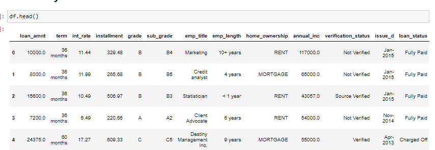
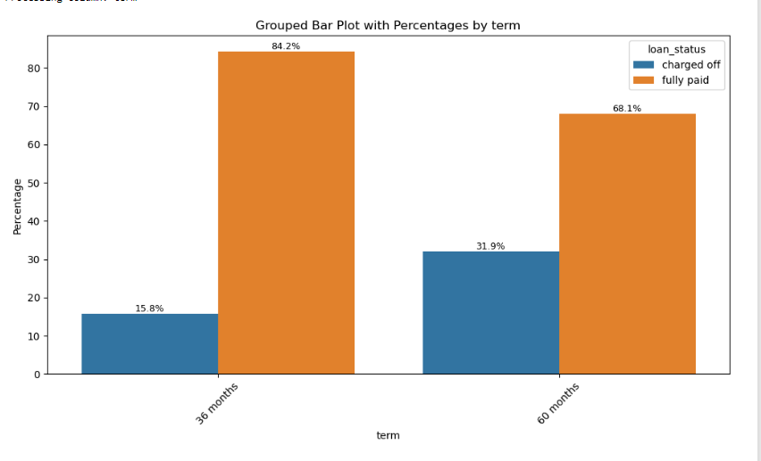
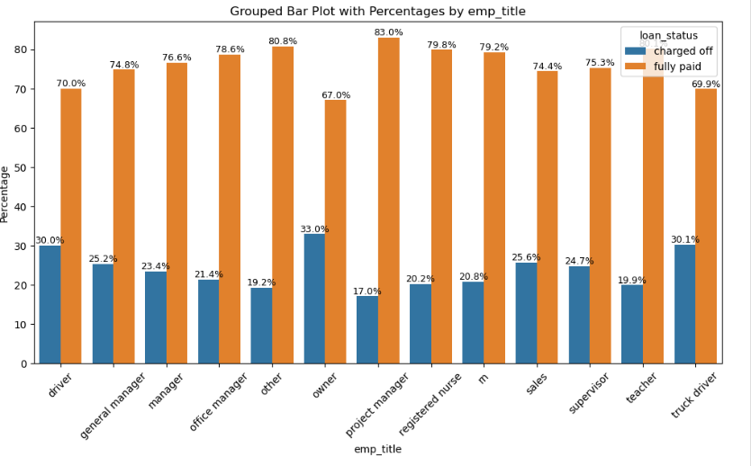
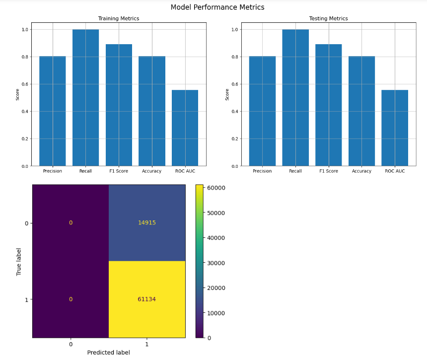

# Jamboree Graduate Admissions Analysis

## Description
Jamboree has assisted thousands of students in gaining admission to top colleges abroad. By providing unique problem-solving methods for exams like GMAT, GRE, and SAT, Jamboree ensures maximum scores with minimum effort. They recently launched a feature on their website that allows students to check their probability of getting into Ivy League colleges. This feature estimates the chances of graduate admission from an Indian perspective.

## Business Problem
Understanding the key factors influencing graduate admissions is crucial for Jamboree. This analysis aims to identify important factors, understand their interrelationships, and predict an applicant's chances of admission based on these variables.

## Business Insights
Data:

### Exploratory Data Analysis (EDA)
- **Outliers:** No outliers in the continuous variables.
- **Distribution:** None of the continuous variables follow a normal distribution.
- **Correlation:** All variables are positively correlated.
  
- **Important Factors:** The chance of admission is highly dependent on GRE scores and CGPA.
   
- **Data Quality:** No missing data or duplicates were found.
- **Boxplot Analysis:** Confirmed the absence of outliers.

### Initial Linear Regression Model

1. **Adjusted R-squared:** Good with 0.80 explainability. SOP and University rating p-values are >0.05, so SOP was dropped to rebuild the model.
2. **Overfitting:** No overfitting observed; Train and Test Adj R^2 are close.
3. **Metrics Consistency:** RMSE and other metrics are consistent.
4. **Residual Plot:** The residual plot indicates no heteroscedasticity (p-value > alpha).

### Feature Dropping

- After dropping SOP, the residual plot improved, and other metrics remained stable.

- **Feature Importance:** CGPA is the most important variable.
- **Multicollinearity:** VIF values show no multicollinearity issues (threshold < 5).

### Advanced Models (Lasso and Ridge Regression)
  
  
- **Model Metrics:** RMSE, R², and adjusted R² are consistent with the OLS model.
- **Residuals:** Residuals are homoscedastic.
- **Predictions:** The models perform well, but slightly lag in lower probabilities. More complex models or additional features could improve this.

## Variable Distributions and Relationships
- **Predictor Contribution:** Each predictor variable significantly contributes to the model.
- **R-squared:** 0.822 - 82.2% of the variance in "Chance of Admit" is explained by the predictors.
- **Adjusted R-squared:** 0.819 - Accounts for model complexity.
- **F-statistic:** 258.1 - Indicates the predictors are jointly significant.
- **Prob (F-statistic):** 1.67e-142 - The model is highly statistically significant.

## Model Building Approaches
- **Initial Linear Regression:** Dropped non-significant variables.
- **Feature Importance Analysis:** CGPA identified as the most critical predictor.
- **VIF Analysis:** Ensured no multicollinearity.
- **Lasso and Ridge Regression:** Confirmed consistency in model performance.
- **Residual Analysis:** Ensured homoscedasticity.

## Recommendations
### Additional Data for Model Improvement
- Undergraduate Major
- Undergraduate Institution Reputation
- Leadership Roles and Extracurricular Activities
- Awards and Honors
- Relevant Work Experience (Years)
- Internships
- Quality of Personal Statement or Essays
- Strength of Letters of Recommendation
- Geographic Location
- Socioeconomic Status

### Potential Benefits from Model Improvement
- **Informed Decisions:** Smarter selection of candidates aligning with institutional goals.
- **Efficient Review:** Streamlined application process focusing on high-potential candidates.
- **Higher Yield:** Increased likelihood of accepted students enrolling.
- **Stronger Reputation:** Better student outcomes and enhanced institutional standing.
- **Aligned Goals:** Supports strategic objectives like diversity and academic focus.

---

By leveraging this analysis, Jamboree can refine their admission prediction models, offering a more accurate and insightful tool for prospective students and aligning their services with institutional goals.